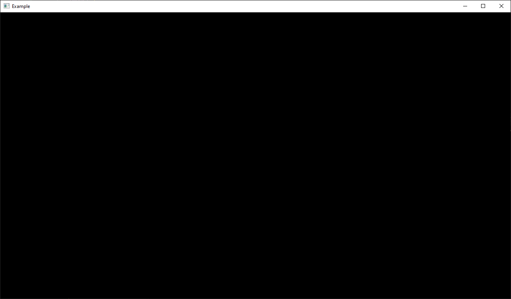

# glfw-go

A binding for glfw in Go.

## Example

Try the example with `go run github.com/nitrix/glfw-go/example@latest`.

The sources for it are located here [example/example.go](example/example.go).

## Usage

The API is kept intentionally compatible and swappable with `github.com/go-gl/glfw`. You may either import directly `github.com/nitrix/glfw-go` or if you have too many transitive dependencies to change, then you coudl add `replace github.com/go-gl/glfw => github.com/nitrix/glfw-go` to your `go.mod` file.

## License

This is free and unencumbered software released into the public domain. See the [UNLICENSE](UNLICENSE) file for more details.
